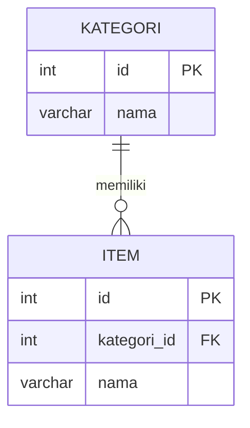

# Rancangan Database

Tuliskan ERD asli (dapat menggunakan Mermaid) dan hubungan antar-entitas.

```mermaid
erDiagram
  KATEGORI ||--o{ ITEM : memiliki
  KATEGORI { int id PK
             varchar nama }
  ITEM { int id PK
         int kategori_id FK
         varchar nama }
```
